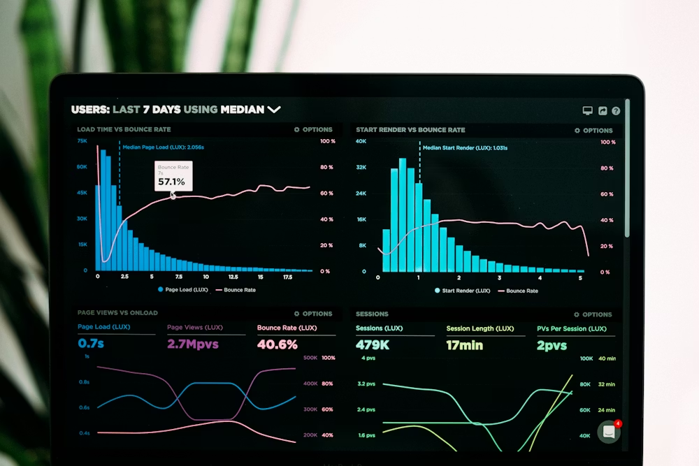

# Saheer MK - Developer Portfolio

A cinematic, highly-optimized developer portfolio built with React 19, Vite, Framer Motion, and React Three Fiber.

 *(Example Project Preview)*

## 📚 Documentation

Detailed documentation has been created for this project, covering technical architecture, design decisions, and content management.

Please see the comprehensive guide here:
👉 **[Documentation & User Guide](./docs/README.md)**

## 🚀 Quick Start

```bash
# Install dependencies
npm install

# Start development server
npm run dev
```

## ✨ Features
* **Cinematic 3D Entry:** WebGL glowing orb scene using React Three Fiber.
* **Physics-based Scrolling:** Buttery smooth global scrolling powered by Lenis.
* **Dynamic Animations:** Re-triggering scroll reveals using Framer Motion.
* **AEO & SEO Optimized:** Advanced dual-schema JSON-LD tailored for AI extraction and standard search engines.
* **Privacy First:** 100% locally hosted assets and fonts. Zero external CDNs.
