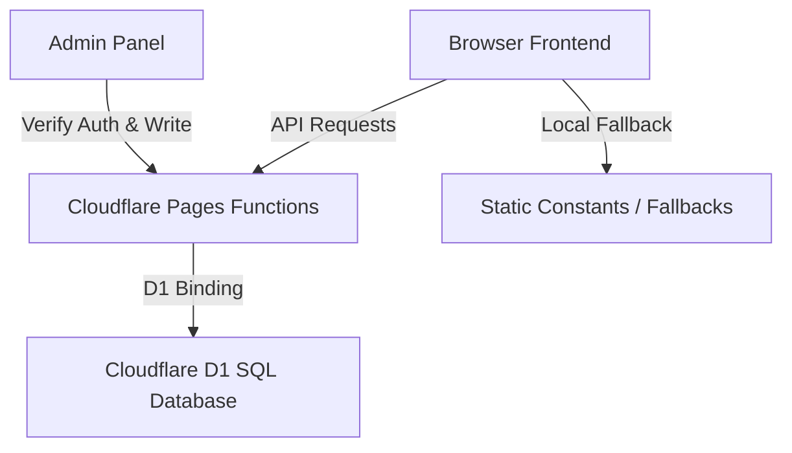

# Saheer MK Portfolio - Architecture & User Guide

Welcome to the documentation for the Saheer MK Developer Portfolio. This document outlines the serverless architecture, database schema, fallback states, and guidelines on how to manage and customize the portfolio.

---

## 🏗 Architecture Overview

The portfolio is built as a single-page application (SPA) focused on cinematic animations, premium design, and aggressive SEO/AEO (Artificial Intelligence Engine Optimization), backed by Cloudflare serverless capabilities.

### Tech Stack
*   **Core**: React 19, TypeScript, Vite
*   **Backend Functions**: Cloudflare Pages Functions (Serverless Node-like Javascript endpoints)
*   **Database**: Cloudflare D1 (Serverless SQL Database)
*   **Styling**: Tailwind CSS v4 (using the `@theme` directive)
*   **Animations**: Framer Motion & physics-based smooth scrolling via Lenis
*   **3D Graphics**: React Three Fiber (`@react-three/fiber`) & Drei (`@react-three/drei`)
*   **Fonts**: 100% locally hosted via `@fontsource` and custom woff2/ttf files.

---

## 💾 Database Schema

The SQLite schema initialized on D1 (see [schema.sql](file:///home/saheer/Documents/portfolio/schema.sql)) consists of the following tables:

### 1. `projects`
Stores portfolio items displayed in the work grid:
*   `id` (TEXT, PRIMARY KEY): Unique lowercase slug/URL identifier.
*   `title` (TEXT, NOT NULL): Name of the project.
*   `category` (TEXT, NOT NULL): The discipline (e.g., Web App, Android Application).
*   `description` (TEXT, NOT NULL): Detailed copy describing the project.
*   `image_url` (TEXT): URL or Base64 data URI of the showcase image.
*   `stack` (TEXT): JSON array string storing technology tag strings (e.g. `["React", "Vite"]`).
*   `link` (TEXT): External website or source repository URL.
*   `aspect_ratio` (TEXT): Layout card size (`square` | `wide` | `tall`).
*   `sort_order` (INTEGER): Determines layout sequence (ascending).

### 2. `skills`
Stores technology pills shown in the About section:
*   `name` (TEXT, PRIMARY KEY): Name of the skill (e.g., TypeScript, Docker).

### 3. `site_config`
Key-value table for site-wide variables:
*   `key` (TEXT, PRIMARY KEY): Config field (e.g., `name`, `email`, `linkedin`).
*   `value` (TEXT, NOT NULL): Corresponding value string.

---

## 🛡 Security & Authentication

The administrative actions are protected via password-based authorization:
*   **Environment Variable**: The password is read from the `ADMIN_PASSWORD` environment variable.
    *   **In Production (Cloudflare Pages)**: Go to **Settings** -> **Environment variables** in the Cloudflare Pages dashboard, add/modify `ADMIN_PASSWORD` (under Production/Preview environments), and trigger a redeploy.
    *   **In Local Development**: Create a file named `.dev.vars` in your project root containing `ADMIN_PASSWORD=your-password`. Wrangler automatically reads this file for local environment variables.
    *   **Fallback**: If not set, it defaults to `"admin"`.
*   **Login Verification**: Sending the password to `/api/admin/verify` returns success if it matches.
*   **Token Authentication**: The password itself acts as a Bearer token. Requests to write APIs (`/api/admin/*`) require the header:
    `Authorization: Bearer <password>`
*   **Session State**: Session persistence is handled client-side using `localStorage`.

---

## 📖 User Guide (Content Management)

There are two ways to manage portfolio content: via the **Control Panel UI** or **Static Fallbacks**.

### Method A: Deployed Control Panel (Recommended)
1.  Navigate to `/admin` on your deployed site (e.g., `https://saheermk.pages.dev/admin`).
2.  Enter your custom `ADMIN_PASSWORD`.
3.  **Projects Tab**: Add projects using the visual editor. Use the file uploader to load screenshots; they will be encoded to Base64 automatically and stored in the database.
4.  **Skills Tab**: Add or delete skill tags.
5.  **Config Tab**: Edit your display name, role title, contact email, social links, and SEO title/description meta tags. You can also upload a custom CV resume PDF (under 1MB). It will be encoded as base64, stored in D1, and served dynamically.

### Method B: Static Fallbacks (Resilience Mechanics)
If Cloudflare services are down or the database binding is disconnected, the site automatically falls back to static files. To customize these fallbacks:
*   **Global configurations**: Edit `src/config/site.ts`
*   **Static skills list**: Edit the `SKILLS` array in `src/sections/About.tsx`
*   **Static projects list**: Edit the `PROJECTS` array in `src/sections/Projects.tsx`

---

## 🎨 Theme Colors & Styling
*   **File**: `src/index.css`
*   Colors are defined in the Tailwind v4 `@theme` block.
*   To change the primary accent color (currently the vibrant orange `#ff4d00`), simply update the `--color-accent` variable. The glowing orb, text highlights, and button borders will adapt automatically.
